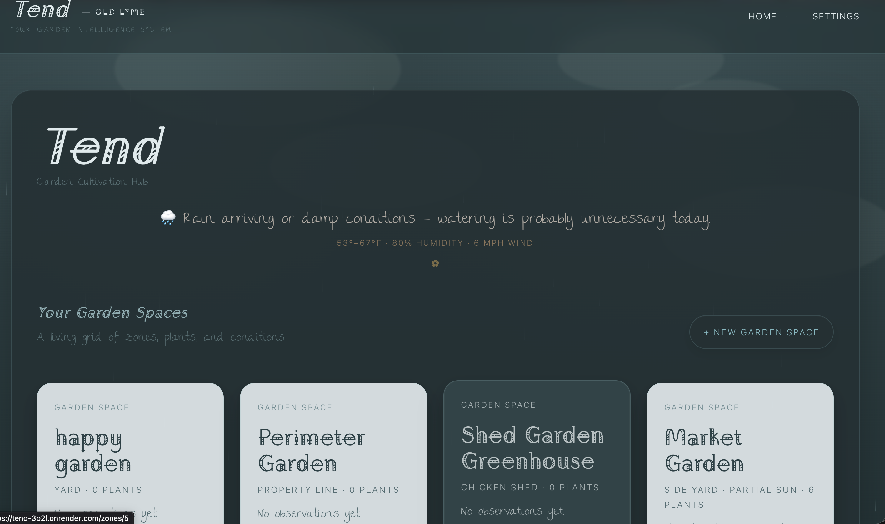

# Tend — Intelligent Garden Tracking & Reflection App

#### Live Application: https://tend-3b2l.onrender.com  
#### Demo Video: https://youtu.be/urqQSYvYAzM  
#### Repository: https://github.com/audball711/tend  

---

## Preview



---

## Overview

Tend is a full-stack web application designed to help users track, understand, and reflect on their garden spaces through a simple, structured system.

The application introduces a zone-based model where users log observations over time and receive focused, AI-generated reflections. Rather than overwhelming users with data or automation, Tend emphasizes clarity, simplicity, and real-world context.

This project reflects my approach to building software: thoughtful systems, clean architecture, and user-first design.

---

## Key Features

- Zone-Based Tracking  
  Organize physical spaces (garden beds, areas of land) into structured zones. Each zone maintains its own history and environmental context.

- Observation Logging  
  Timestamped notes stored in PostgreSQL to build a historical dataset for each zone.

- AI Reflection Engine  
  Generates a single, focused insight based on recent observations to support decision-making without overwhelming the user.

- Environmental Context Integration  
  Weather-aware and time-of-day-aware UI with a dynamic theme system (sunny, rainy, cloudy, dawn, dusk, night).

- Shared Demo Environment  
  The live app operates as a shared space so multiple users can explore functionality without authentication.

---

## Technical Stack

Backend  
- Python  
- Flask (application factory pattern)  
- PostgreSQL  

Frontend  
- HTML  
- CSS  
- JavaScript  
- Jinja  

Infrastructure  
- Render  
- GitHub  

AI Integration  
- Context-aware prompt construction using structured user data  

---

## Architecture

The application uses a modular Flask structure with clear separation of concerns.

Core components:

- tend/__init__.py  
  Initializes the app using the application factory pattern  

- tend/routes.py  
  Handles routing, forms, and reflection logic  

- tend/db.py  
  PostgreSQL connection and queries  

- tend/weather_theme.py  
  Weather and UI theming logic  

- tend/page_context.py  
  Injects shared data into templates  

- tend/helpers.py  
  Utility functions  

- templates/  
  Jinja templates  

- static/  
  CSS and JavaScript  

- schema.sql / plants.sql  
  Database structure and seed data  

---

## Key Engineering Decisions

- PostgreSQL over SQLite  
  Migrated to a production-ready database for scalability  

- Application Factory Pattern  
  Improves modularity and scalability  

- Single Insight UX  
  Returns one meaningful insight instead of overwhelming users  

- Context-Driven AI  
  Uses real user data instead of generic suggestions  

- Separation of Concerns  
  Keeps routing, database, and UI logic cleanly divided  

---

## Running Locally

1. Install dependencies
```bash
pip install -r requirements.txt
```

2. Set up PostgreSQL  
Create a database and get a connection string.

3. Set environment variable  

macOS/Linux:
```bash
export DATABASE_URL="your_connection_string"
```

Windows:
```bash
set DATABASE_URL=your_connection_string
```

4. Run the app
```bash
flask run
```

---

## What This Project Demonstrates

- Building and deploying a full-stack application  
- Designing backend architecture with Flask  
- Working with PostgreSQL  
- Structuring real-world data models  
- Creating intentional user experiences  
- Integrating AI in a practical way  
- Debugging, refactoring, and deploying to production  

---

## Background

I come from a background in hospitality, event management, and SaaS sales, where I developed strong communication and problem-solving skills.

I transitioned into software development through Harvard’s CS50 and hands-on project work. Tend represents my ability to take an idea from concept to deployment.

This combination of technical ability and customer-facing experience positions me well for:

- Junior Software Engineer roles  
- Sales Engineer / Solutions Engineer roles  
- Product-focused technical roles  

---

## Future Development

- User accounts and personalized environments  
- Plant-level tracking  
- Planning tools and materials systems  
- Local-first (Raspberry Pi) version  
- Expanded AI tied to user-owned data  

---

## Closing

Tend is intentionally simple, but deeply considered.

It reflects how I approach building software:
- grounded in real use cases  
- designed for clarity  
- structured for growth  

I am actively seeking opportunities where I can continue building and contributing to meaningful products.